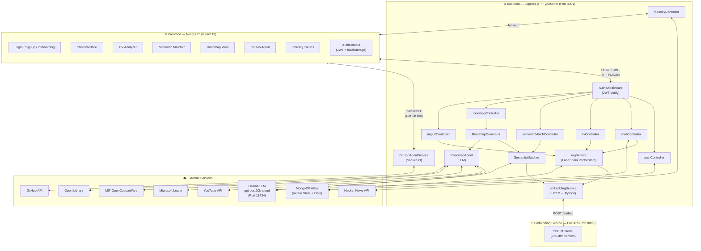
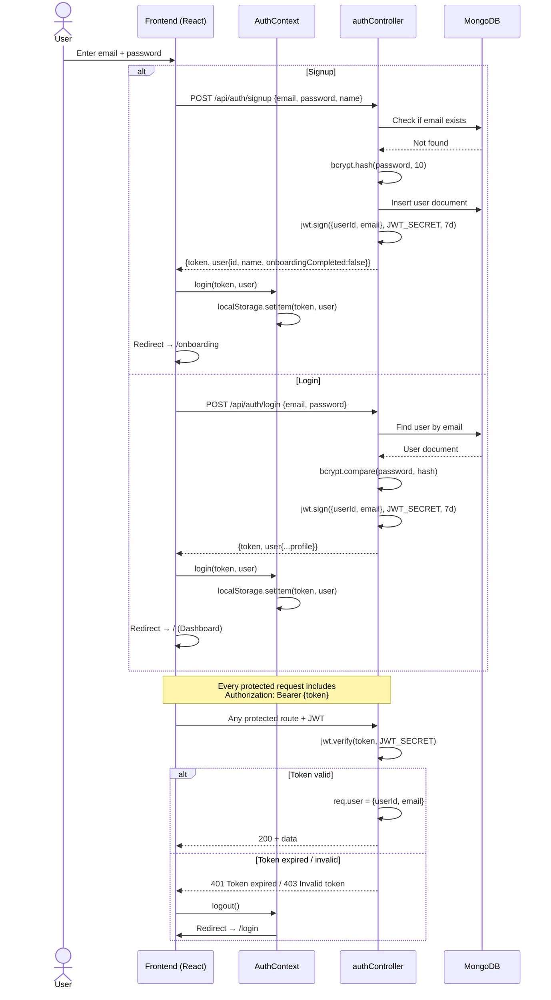
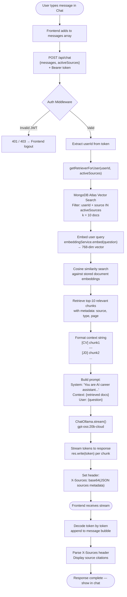
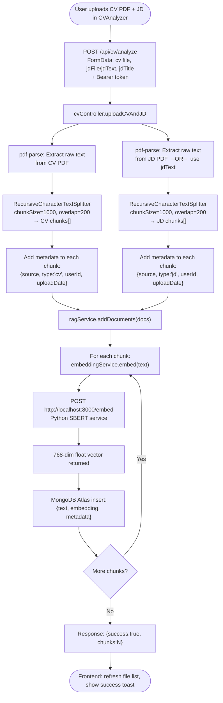
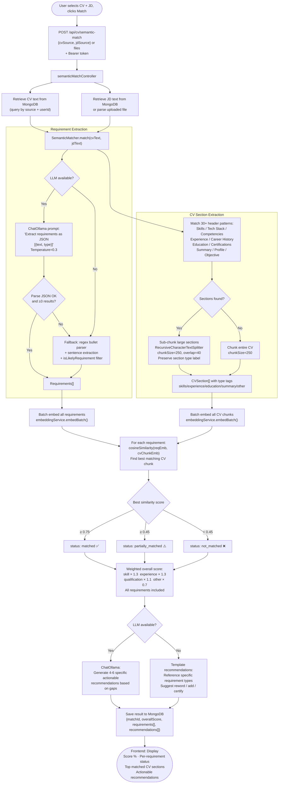
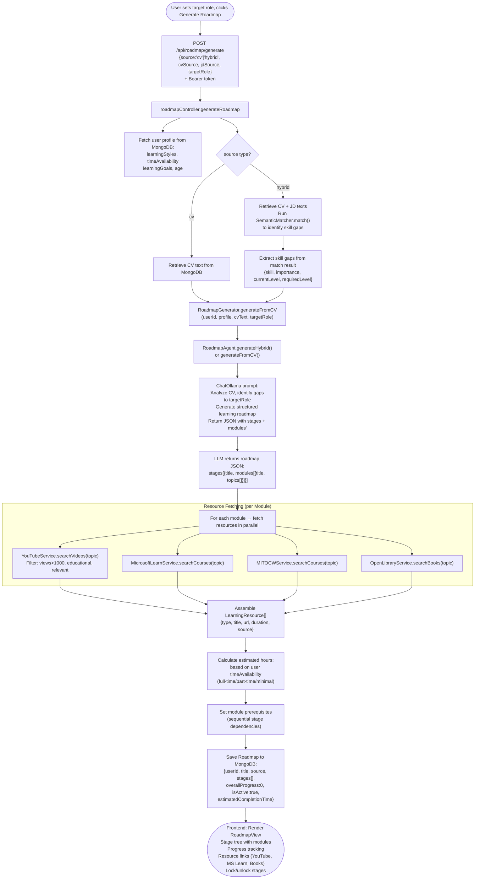
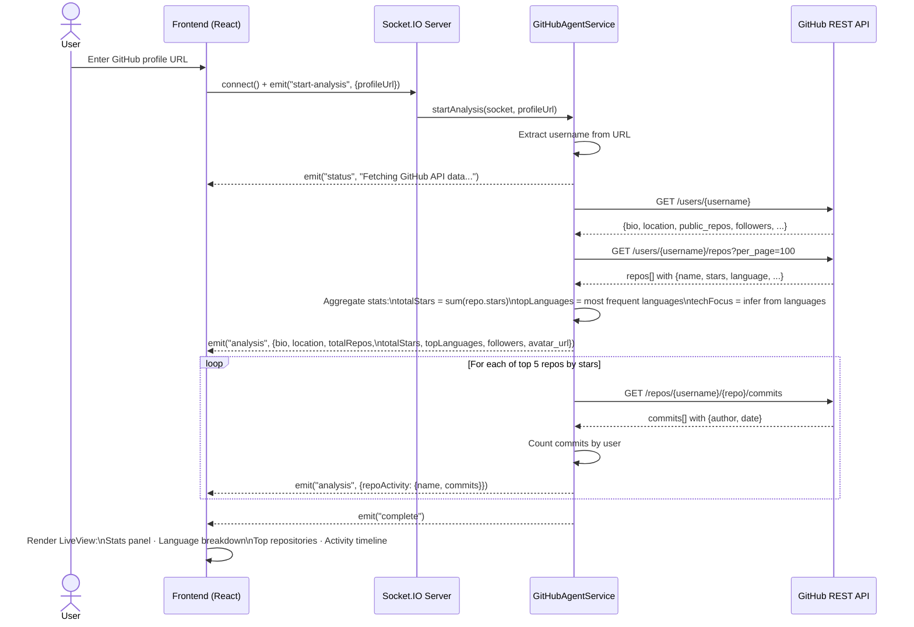
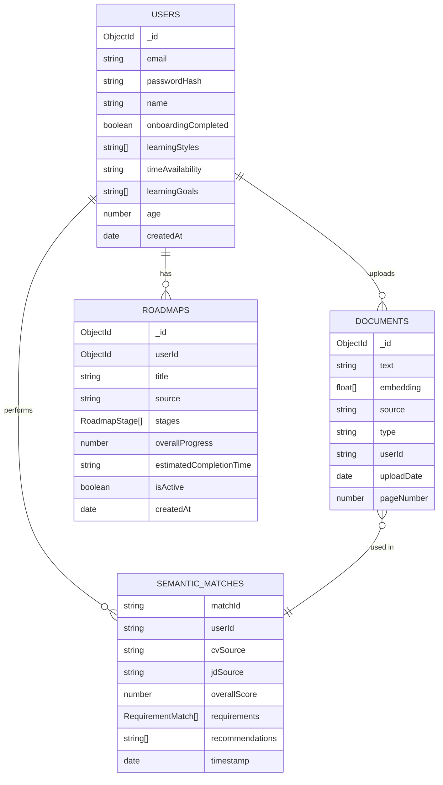
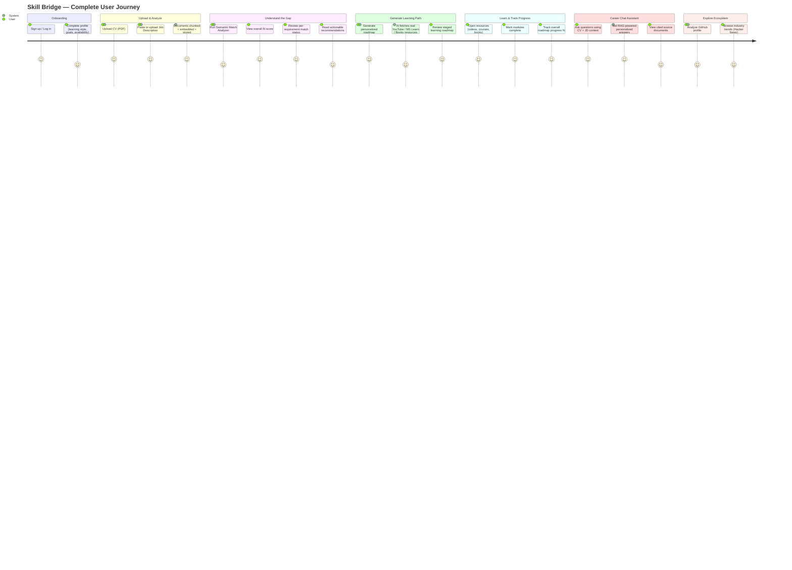

# Skill Bridge — System Process Workflow Charts

---

## 1. System Architecture Overview

---

## 2. Authentication Flow

---

## 3. RAG Chat Pipeline

---

## 4. CV Upload & Ingestion Flow

---

## 5. Semantic Match Analyzer Flow

---

## 6. Roadmap Generation Flow

---

## 7. GitHub Profile Analysis Flow

---

## 8. Data Architecture

---

## 9. End-to-End User Journey

