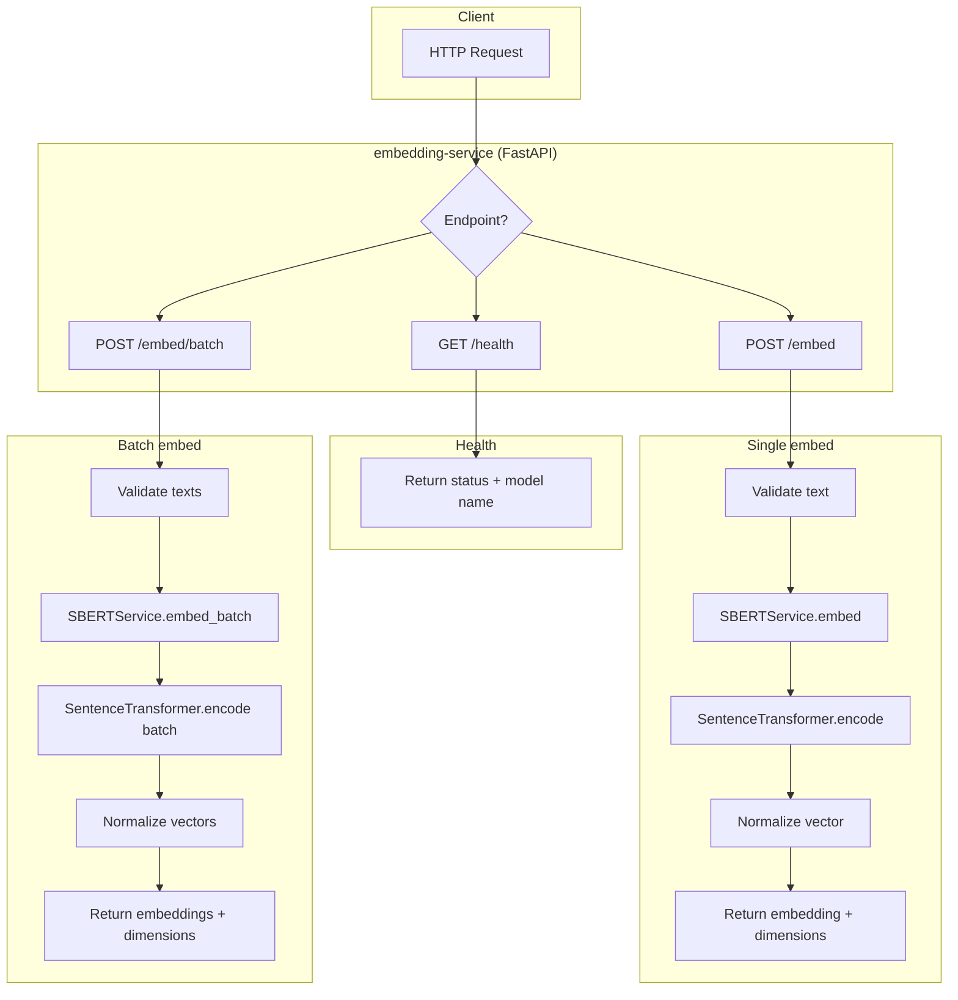
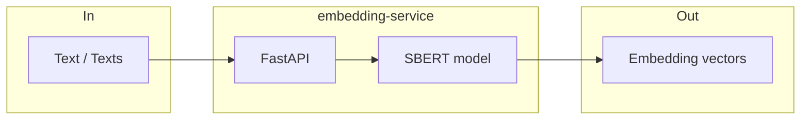

# Embedding Service — Flow

## Simplified flow

- **Single:** `POST /embed` → one text → one vector (e.g. 768 dims).  
- **Batch:** `POST /embed/batch` → list of texts → list of vectors.  
- **Health:** `GET /health` → status and model name (no ML).
